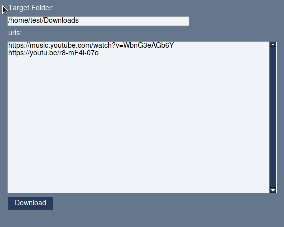

# Download youtube Songs



A Gui python application to download a list of youtube songs.

## Requirements

* python3
* pip
* Debian (or a derivative distro)


## How to use

1. clone this repo
2. use the [setup.sh script](./setup.sh)
```bash
cd download-youtube-songs
sh ./setup.sh
```
3. run the [download script](./download.py)
```bash
./download.py
```
4. set you target folder
5. put the urls on each line (you can also insert playlists)
6. click at download button


